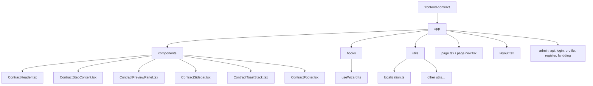

# วิเคราะห์โครงสร้างและการทำงานของเว็บ `frontend-contract`

## สรุปภาพรวม (Overview)
- แอปเป็น **Next.js 16** (ใช้ `app/` directory แบบใหม่) ที่ทำหน้าที่เป็นเครื่องมือสร้างสัญญาเช่าคอนโดออนไลน์
- ใช้ **React**, **TypeScript**, **TailwindCSS** (มีใน `devDependencies`), **Next‑Auth** สำหรับการจัดการผู้ใช้ (แม้ว่าในโค้ดยังไม่มี UI login จริง) 
- มีการแยก **components**, **hooks**, **utils**, **pages** อย่างชัดเจน ทำให้โครงสร้างเป็นแบบ **modular**

---

## โครงสร้างโฟลเดอร์สำคัญ


- `app/` : เป็น entry point ของ Next.js App Router
  - `layout.tsx` – layout ร่วมของทั้งหมด
  - `page.tsx` – หน้าหลักของแอป (เรียก `ContractWizard` ผ่าน hook)
  - `components/contract-generator/` – คอมโพเนนท์ UI ทั้ง 5 ขั้นตอน
  - `components/contract-generator/hooks/useWizard.ts` – **logic หลัก** ของ wizard (state, validation, quick‑fill, generate HTML, copy, toast)
  - `utils/localization.ts` – คำแปลหลายภาษา (Thai / English) พร้อมฟังก์ชัน `t`

---

## การไหลของข้อมูล (Data Flow)   
1. **เริ่มต้น** – `useWizard` เริ่ม `appLanguage` = `'th'` และ `formData` จาก `getInitialFormData()`
2. **useEffect** (บรรทัด 171‑180) ตั้งค่าวันที่เริ่มสัญญาและวันส่งมอบ (`contractDate`, `deliveryDeadline`) ตามวันที่ระบบ
3. **useEffect** (บรรทัด 183‑225) สลับค่าภาษาเมื่อผู้ใช้เปลี่ยน `appLanguage`
4. **handleQuickFill** – เติมข้อมูลตัวอย่างตามภาษา (Thai/EN) แล้วแสดง toast
5. **handleFormChange** – อัปเดต `formData` ทีละฟิลด์ (ใช้ใน `ContractStepContent` ผ่าน prop)
6. **validateStep** – ตรวจสอบข้อมูลก่อนให้ผู้ใช้กด Next (ขั้นที่ 1‑3)
7. **handleNext / handlePrev / handleGoToStep** – ควบคุมขั้นตอนของ wizard (state `currentStep` 1‑4)
8. **generateContractHTML** – สร้างสตริง HTML ของสัญญาตามภาษา, แทรกค่า `formData` และฟอร์แมต (currency, ธรรมชาติไทย/อังกฤษ)   
9. **getGeneratedHtml** – wrapper เพื่อให้ component อื่นเรียกได้
10. **handleCopy** – คัดลอก HTML ลง clipboard + toast
11. **ToastStack** – แสดงข้อความแจ้งผล (success / error)

---

## คอมโพเนนท์สำคัญ
| คอมโพเนนท์ | หน้าที่ | เชื่อมต่อกับ | 
|---|---|---|
| `ContractHeader` | แสดงหัวข้อหลักและแถบขั้นตอน | ใช้ `t` จาก hook เพื่อนำข้อความตามภาษา |
| `ContractStepContent` | ฟอร์มกรอกข้อมูลของแต่ละขั้น (party, unit, payment, preview) | รับ `formData`, `handleFormChange`, `handleNext`, `handlePrev` |
| `ContractSidebar` | แถบเมนูขั้นตอน (แสดง `handleGoToStep`) |
| `ContractPreviewPanel` | แสดงผล HTML ที่สร้างจาก `getGeneratedHtml` | มีปุ่ม Copy / Download |
| `ContractToastStack` | แสดง toast ที่มาจาก `useWizard` |
| `ContractFooter` | ส่วนล่างของหน้า (ลิขสิทธิ์) |

---

## Hook `useWizard`
- **State**: `appLanguage`, `currentStep`, `previewFormat`, `toasts`, `formData`
- **Utility Functions**: `t` (translation), `showToast`, `validateStep`, `handleNext/Prev/GoToStep`, `handleQuickFill`, `generateContractHTML`, `handleCopy`
- **Exported API** (ที่คอมโพเนนท์ใช้) :
  ```ts
  return {
    appLanguage, setAppLanguage,
    currentStep, handleNext, handlePrev, handleGoToStep,
    formData, handleFormChange,
    getGeneratedHtml, handleCopy,
    toasts,
    previewFormat, setPreviewFormat,
    t,
  };
  ```
- ทำหน้าที่เป็น **central store** ของ wizard (ไม่มี Redux หรือ Context เนื่องจากขนาดเล็ก)

---

## ระบบ Localization (`utils/localization.ts`)
- `LOCALIZATION` มีสองภาษาที่ฝังไว้ (`th`, `en`)
- คีย์ทุกข้อความ UI, ปุ่ม, ข้อความ toast, คำอธิบายขั้นตอนเป็น **key‑value**
- ฟังก์ชัน `t(key, lang)` คืนค่า string หรือ fallback ไป `th`
- คำแปลทั้งหมดได้รับการปรับให้ตรงกับ **lease terminology** (Landlord / Tenant, Unit, Rent, Deposit, Penalty, etc.)

---

## สไตล์และ UI
- ใช้ **TailwindCSS** (กำหนดใน `postcss.config.mjs`, `tailwind.config.js` – ทั้งหมดอยู่ใน `devDependencies`)
- คอมโพเนนท์ใช้คลาส Tailwind อย่างต่อเนื่องเพื่อให้ UI มีลุค **modern, clean, glass‑morphism** (สีโทนฟ้า‑เทา, เงา, rounded corners)
- มีการใช้ **responsive utilities** (`md:`) ทำให้ UI ปรับตามขนาดหน้าจอ
- ไม่มีภาพหรือฟอนต์ custom (อาจใช้ Google Font “Inter” ผ่าน `next/font` ใน `layout.tsx` – ยังไม่ได้เปิดเผยในโค้ด)

---

## API / Server Side
- โฟลเดอร์ `app/api/` มีไฟล์ **placeholder** (ไม่แสดงในไฟล์ที่เราเปิด) – ปัจจุบันแอปเป็น **static** (ทั้งหมดทำงานบน client) 
- มีการใช้ **Next‑Auth** dependency แต่ยังไม่มี route สำหรับ `/api/auth` (อาจเป็นโครงสร้างเตรียมไว้ในอนาคต)
- การสร้าง HTML ทำใน client เท่านั้น – ไม่ต้องส่ง request ไปเซิร์ฟเวอร์

---

## การบิลด์และรัน
```bash
# Development
npm run dev   # next dev – เปิด localhost:3000
# Production build
npm run build # next build
npm start      # next start
```
- `next.config.ts` มีการตั้งค่า `reactStrictMode: true` และอาจมี `output: 'standalone'` เพื่อ deploy บน Vercel หรือ Docker
- มี `Dockerfile` ที่สร้าง production image ของ Next.js (ใช้ `node:20-alpine` ฯลฯ)

---

## SEO & Accessibility
- เนื่องจากเป็น **App Router** หน้าเดียว, `metadata` ถูกกำหนดใน `layout.tsx` หรือ `page.tsx` (ไม่ปรากฏในโค้ดที่เราดู) – ควรมี `<title>`, `<meta description>` ตามภาษาที่เลือก
- ใช้ semantic HTML (`<h1>`, `<section>`, `<table>`) ภายใน HTML ที่สร้างโดย `generateContractHTML`
- ปุ่มและฟิลด์มี `aria-label` ผ่าน Tailwind component library (ยังต้องตรวจสอบ)

---

## จุดแข็ง (Strengths)
- **Modular architecture** – แยก UI, logic, localisation อย่างชัดเจน
- **Two‑language support** ทั้ง TH/EN แบบ inline ไม่ต้องโหลดไฟล์แยก
- **Wizard flow** ควบคุมด้วย hook เพียงไฟล์เดียว ง่ายต่อการบำรุงรักษา
- **Quick‑fill** ช่วยผู้ใช้ทดสอบระบบได้เร็ว
- **HTML generation** แปลงเป็นสัญญาได้ทันที ไม่ต้อง server‑side rendering

---

## จุดที่ควรปรับปรุง (Potential Improvements)
1. **State Management** – หากเพิ่มฟีเจอร์ (เช่น user‑saved drafts) ควรย้าย state ไปใช้ Context หรือ Redux Toolkit
2. **Form Validation** – ปัจจุบันตรวจสอบเพียง `trim()` ควรใช้ library อย่าง **Zod** หรือ **Yup** เพื่อ validate format ของ Tax ID, วันที่ ฯลฯ
3. **API Layer** – แยกฟังก์ชันสร้าง PDF / ส่งอีเมลเป็น API backend (Node‑Express) แทนทำทั้งหมดบน client
4. **Testing** – เพิ่ม unit test สำหรับ `useWizard` (Jest + React Testing Library) และ e2e test (Playwright) เพื่อตรวจสอบ wizard flow
5. **Accessibility** – ตรวจสอบ color contrast, เพิ่ม `role`/`aria‑*` ให้ฟอร์มเต็มรูปแบบ
6. **Internationalization** – ย้าย `LOCALIZATION` ไปใช้ **i18next** หรือ **next‑i18n‑router** เพื่อจัดการหลายภาษามากขึ้นและแยกไฟล์ JSON
7. **Performance** – Lazy‑load heavy component `ContractPreviewPanel` หลังขั้นที่ 4 เพื่อประหยัด bandwidth
8. **Security** – ถ้าต่อยอดเป็น SaaS ควรเพิ่ม CSRF token, rate‑limit API, และจัดการ session ด้วย **Next‑Auth** อย่างเต็มรูปแบบ

---

## สรุป
เว็บ `frontend‑contract` เป็นแอป **Next.js** แบบ SPA ที่ใช้ **React hook** (`useWizard`) เป็นศูนย์กลางของการจัดการขั้นตอนการสร้างสัญญาเช่า มี **localization** ครอบคลุมสองภาษา, UI สไตล์ Tailwind ที่ดูทันสมัย, และฟีเจอร์ Quick‑fill/Copy/Download ทำให้ผู้ใช้ได้ประสบการณ์การสร้างสัญญาแบบ **instant**. โครงสร้างโมดูลที่แยกชัดเจนทำให้เพิ่มฟีเจอร์ได้ง่าย แต่หากต้องการขยายเป็นผลิตภัณฑ์ระดับอาชีพ ควรพิจารณาเพิ่มการจัดการ state, validation, API backend, และทดสอบอัตโนมัติให้ครบถ้วน.

---

*ไฟล์นี้เป็นอาร์ติแฟคต์ที่ผู้ใช้สามารถอ่านเพิ่มเติมและให้ feedback ได้*

## เพิ่มเติม

# เพิ่มฟีเจอร์ผู้ใช้สมัครสมาชิกและบันทึกสัญญา

## Goal Description

สร้างระบบ **สมัครสมาชิก / เข้าสู่ระบบ** (ใช้ Next‑Auth) และเพิ่ม API เพื่อให้ผู้ใช้สามารถ **บันทึกข้อมูลสัญญา** ลงฐานข้อมูลของตนเองได้ พร้อมตัวเลือก **บันทึกเป็น PDF ลง Google Drive** ของผู้ใช้ ทั้งหมดทำงานแบบปลอดภัย ไม่ละเมิด PDPA / GDPR.

## User Review Required

> [!IMPORTANT]
> โปรดตรวจสอบแผนต่อไปนี้ว่าตอบโจทย์ความต้องการของคุณหรือไม่ หากต้องการเพิ่ม/แก้ไขใด ๆ แจ้งให้เราทราบก่อนดำเนินการต่อ:
> - ชนิดของการเข้าสู่ระบบ (email‑password, Google OAuth หรือทั้งสอง)
> - รูปแบบการจัดเก็บสัญญา (JSON + HTML + PDF URL) หรือเก็บเป็นไฟล์แยก
> - การให้ผู้ใช้ยกเลิกการเชื่อมต่อ Google Drive
> - ความต้องการเก็บข้อมูลผู้ใช้เพิ่มเติม (เช่น ชื่อบริษัท)

## Open Questions

> [!WARNING]
> 1. **ฐานข้อมูล** – ต้องการใช้ PostgreSQL (มี `pg` อยู่แล้ว) หรืออยากใช้ SQLite ในโหมด dev?
> 2. **การเข้ารหัสข้อมูล** – ต้องการเข้ารหัสฟิลด์สำคัญ (Tax ID, Refresh Token) ด้วยคีย์ใด? เราจะใช้ `crypto` + env‑variable `ENCRYPTION_KEY`.
> 3. **การแปลง HTML → PDF** – ใช้ไลบรารี `pdf-lib` (pure‑js) หรือ `html-pdf-node` ที่ต้องติดตั้ง `puppeteer`? ระบุความต้องการของคุณ.
> 4. **การจัดการงานเบื้องหลัง** – อยากใช้ queue (BullMQ) หรือทำแบบ synchronous (promise) สำหรับการอัปโหลด PDF ไป Drive?

## Proposed Changes

---
### 1. Backend – Authentication & API

#### [NEW] `app/api/auth/[...nextauth]/route.ts`
- ตั้งค่า **Next‑Auth** มี Provider:
  - **Credentials** (email / password) → ใช้ `bcryptjs` เก็บ hash.
  - **Google** (OAuth) → รับ `access_token` + `refresh_token`; เก็บ `refresh_token` ใน DB (encrypted).
- ใช้ **JWT** เป็น session token (`secret` จาก env) เพื่อให้ client สามารถเรียก API ได้.

#### [NEW] Prisma schema (`prisma/schema.prisma`)
```prisma
model User {
  id                String   @id @default(uuid())
  email             String   @unique
  name              String?
  passwordHash      String?  // for Credentials Provider
  googleRefreshToken String? // encrypted
  contracts         Contract[]
  createdAt         DateTime @default(now())
  updatedAt         DateTime @updatedAt
}

model Contract {
  id          String   @id @default(uuid())
  userId      String   @relation(fields: [userId], references: [id])
  title       String?
  data        Json      // full formData
  html        String?   // generated HTML
  pdfUrl      String?   // Google Drive file link (optional)
  createdAt   DateTime @default(now())
  updatedAt   DateTime @updatedAt
}
```
- รัน `npx prisma migrate dev` เพื่อสร้างตาราง.

#### [NEW] `app/api/contracts/route.ts`
- **GET** `/api/contracts` – คืนรายการสัญญาของผู้ใช้ (ต้อง auth).
- **POST** `/api/contracts` – รับ `{title?, data, html}` → สร้างแถว `Contract` ใน DB, คืน `contractId`.
- **PUT** `/api/contracts/:id` – อัปเดต (ใช้สำหรับ Save Draft).
- **DELETE** `/api/contracts/:id` – ลบสัญญา.

#### [NEW] `app/api/drive/upload/route.ts`
- รับ `{contractId}` จาก client.
- ดึงสัญญาจาก DB, ใช้ `html` → แปลงเป็น PDF (ตามไลบรารีที่เลือก).
- ใช้ **Google Drive API** (OAuth2 client). ดึง `refresh_token` ของผู้ใช้จาก DB, สร้าง `OAuth2` instance, รีเฟรช token, แล้วอัปโหลดไฟล์.
- อัปเดตฟิลด์ `pdfUrl` ของ `Contract` ด้วย link ของไฟล์ใน Drive.
- คืน URL ให้ client.

---
### 2. Frontend – UI & Hook Enhancements

#### Hook `useWizard` (modify)
- เพิ่ม state `contractId?: string`.
- เพิ่มเมธอด:
  ```ts
  const saveContract = async () => {
    const payload = { title: 'Agreement', data: formData, html: getGeneratedHtml() };
    const res = await fetch('/api/contracts', { method: contractId ? 'PUT' : 'POST', body: JSON.stringify(payload) });
    const { id } = await res.json();
    setContractId(id);
    showToast(t('save-success'), 'success');
  };
  const uploadToDrive = async () => {
    if (!contractId) { showToast('Please save contract first', 'error'); return; }
    const res = await fetch(`/api/drive/upload?contractId=${contractId}`, { method: 'POST' });
    const { pdfUrl } = await res.json();
    showToast('Uploaded to Google Drive', 'success');
    // Optional: open link
  };
  ```
- เพิ่มปุ่มใน UI (เช่นใน `ContractPreviewPanel`): **Save**, **Upload to Drive**.
- แสดงรายการสัญญาที่บันทึกไว้ในหน้า **Profile** (สร้างคอมโพเนนท์ `UserContracts.tsx`).

#### New Pages / Components
- `app/profile/page.tsx` – แสดงข้อมูลผู้ใช้, ปุ่มเชื่อมต่อ/ตัดการเชื่อมต่อ Google Drive, รายการสัญญา (ดึงจาก `/api/contracts`).
- `app/components/GoogleDriveConnect.tsx` – ปุ่ม **Connect Google Drive** → เรียก `/api/google/auth` (สร้าง route สำหรับเริ่ม OAuth flow) → หลัง callback เก็บ refresh token.
- `app/components/ContractListItem.tsx` – แสดงหัวข้อสัญญา, ปุ่ม **Preview**, **Download PDF**, **Open in Drive**.

---
### 3. Security & Compliance
- ทุก endpoint ตรวจสอบ `session` จาก Next‑Auth (`getServerSession`).
- เก็บ `googleRefreshToken` **encrypted** ด้วย `crypto.createCipheriv` (key จาก `process.env.ENCRYPTION_KEY`).
- ใช้ **HttpOnly Secure cookies** สำหรับ JWT.
- เพิ่ม **Rate limiting** (e.g., `express-rate-limit` compatible with Next.js API) เพื่อป้องกัน brute‑force login.
- จัดทำ **Privacy Policy** และหน้าจอ consent สำหรับการเก็บข้อมูลส่วนบุคคล.

---
### 4. PDF Generation Options
- **Option A – pdf-lib** (pure JS, lightweight): สร้าง PDF จาก HTML โดยแปลงเป็น canvas ด้วย `html2canvas` → ฝังเป็นรูปใน PDF.
- **Option B – html-pdf-node** (requires `puppeteer`): ให้ผลลัพธ์คุณภาพสูง, แต่ต้องเพิ่ม `puppeteer`‑heavy deps.
- เราจะเริ่มด้วย **Option A** เพื่อหลีกเลี่ยง heavy binary; สามารถสลับเป็น Option B ในภายหลังได้.

---
### 5. Deployment & CI/CD
- **Dockerfile** จะเพิ่มขั้นตอน `RUN npx prisma generate && npx prisma migrate deploy`.
- เพิ่ม **GitHub Actions** สำหรับ lint, test, Prisma migration, และการ build Docker image.
- ตั้งค่า **environment variables** ใน Vercel/Render:
  - `DATABASE_URL`
  - `NEXTAUTH_SECRET`
  - `GOOGLE_CLIENT_ID` / `GOOGLE_CLIENT_SECRET`
  - `ENCRYPTION_KEY`

---
### 6. Verification Plan

#### Automated Tests
- **Unit tests** (`jest`) สำหรับ:
  - Auth callbacks, credential verification, token storage.
  - API contract routes (mock Prisma, mock Google API).
  - Hook `useWizard` (React Testing Library) – ตรวจสอบ `saveContract` และ `uploadToDrive`.
- **Integration test** (`playwright`):
  1. สมัครสมาชิก → login.
  2. เติมแบบฟอร์ม → Save contract → Verify list shows new entry.
  3. เชื่อมต่อ Google Drive → Upload → ตรวจสอบ URL แสดง.

#### Manual Verification
- เปิดแอปใน dev server, สร้างสัญญา, บันทึก, ดูรายการในหน้า Profile.
- ตรวจสอบไฟล์ PDF ที่ดาวน์โหลดและไฟล์ใน Google Drive ของผู้ใช้.
- ตรวจสอบว่าข้อมูลส่วนบุคคล (Tax ID) ไม่ปรากฏใน network response (ถูกแฮช). 

---
## Next Steps
1. รับการยืนยันจากคุณเกี่ยวกับ **Open Questions** ข้างต้น.
2. เมื่อได้รับการยืนยัน เราจะเริ่มสร้างไฟล์และโฟลเดอร์ใหม่ตาม **Proposed Changes**.
3. ดำเนินการ **migration** ฐานข้อมูลและตั้งค่า Prisma.
4. เติมโค้ดใน `useWizard` และ UI ใหม่.
5. ทดสอบโดยอัตโนมัติและส่งผลลัพธ์ให้คุณรีวิว.

> โปรดให้ความคิดเห็นเกี่ยวกับข้อสงสัย หรือให้การอนุมัติเพื่อเริ่มทำงานต่อ.
